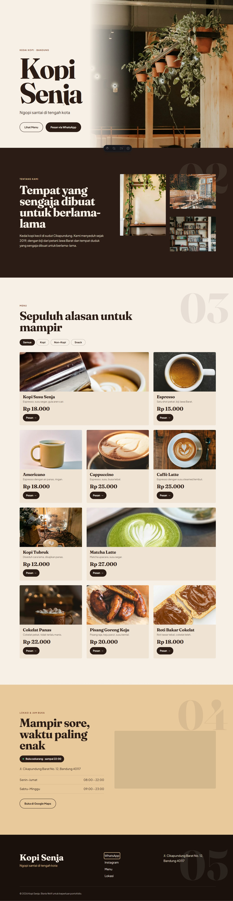
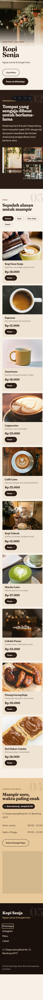

# Kopi Senja

Situs company profile untuk kedai kopi fiktif di Bandung, dengan tombol pesan lewat WhatsApp di setiap menu.



**[Lihat situsnya](https://kopi-senja-brown.vercel.app)**

Lighthouse (mobile, situs live): Accessibility 100, Best Practices 100, SEO 100. CLS 0.00.

## Fitur utama

- **Tombol "Pesan" per menu** berupa link WhatsApp biasa yang dibuat saat build, berisi nama item dan harga. Tetap jalan walau JavaScript mati.
- **Menu dan profil kedai disimpan di JSON** (`src/data/menu.json`, `profil.json`). Build gagal kalau datanya tidak valid, misalnya kategori tidak dikenal, id duplikat, atau harga tidak sah.
- **Filter kategori** dengan `aria-pressed` dan jumlah hasil yang diumumkan lewat `aria-live`.
- **Palet warna senja** (cream, espresso, amber, terakota) yang bergeser dari terang ke gelap saat di-scroll.

## Aksesibilitas

- Kontras 22 pasangan warna dicek otomatis dengan `node scripts/cek-kontras.mjs`. Skrip ini menemukan tiga warna yang tidak lolos, dan semuanya sudah diperbaiki.
- Animasi mati saat `prefers-reduced-motion: reduce`.
- Setiap tombol "Pesan" punya nama aksesibel yang berbeda.
- Tanpa JavaScript, semua kartu menu tetap tampil dan tombol WhatsApp tetap berfungsi.

## Responsif

| Lebar | Grid menu |
|---|---|
| 1440px | 3 kolom |
| 768px | 2 kolom |
| 375px | 1 kolom |



## Stack

Astro (statis), CSS murni, vanilla JavaScript, Vitest, Fontsource, sharp.

## Menjalankan

```bash
npm install
npm run dev
```

| Perintah | Kegunaan |
|---|---|
| `npm test` | 36 unit test untuk `src/lib/` |
| `npm run build` | Build ke `dist/` |
| `npm run preview` | Jalankan hasil build |
| `node scripts/cek-kontras.mjs` | Audit kontras WCAG |
| `node scripts/optimasi-foto.mjs` | Konversi foto di `raw/` ke WebP |

## Batasan

- Badge buka/tutup memakai zona waktu perangkat pengunjung, bukan WIB.
- Jam tutup lewat tengah malam belum didukung.
- Filter tidak menganimasikan perpindahan kartu.

## Foto

Semua foto dari [Unsplash](https://unsplash.com) (Unsplash License). ID tiap foto tercatat di `scripts/kandidat-foto.mjs`.

## Catatan

Kopi Senja adalah bisnis fiktif. Alamat, nomor telepon, jam buka, dan harga bukan data asli.
